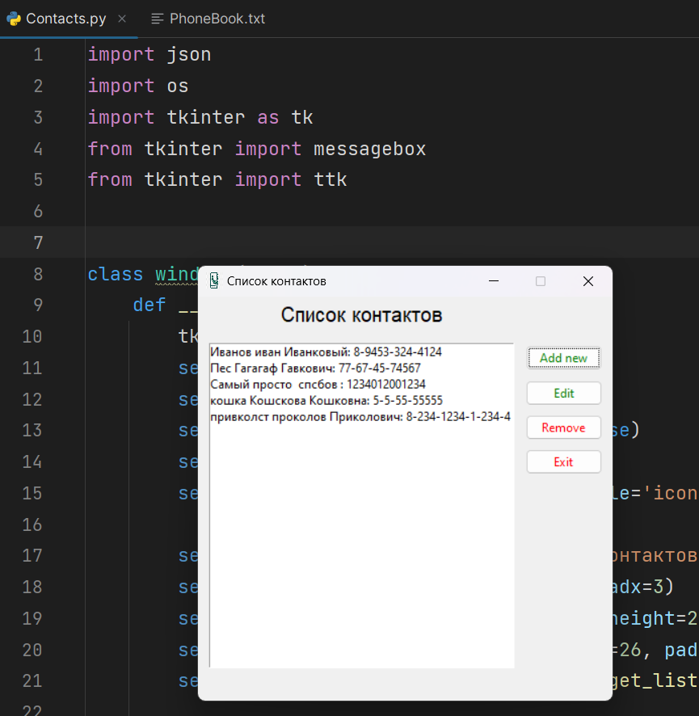

```python
import json
import os
import tkinter as tk
from tkinter import messagebox
from tkinter import ttk


class windows(tk.Tk):
    def __init__(self, c, *args, **kwargs):
        tk.Tk.__init__(self, *args, **kwargs)
        self.contact_list = c
        self.geometry('410x400+300+300')
        self.resizable(width=False, height=False)
        self.wm_title("Список контактов")
        self.iconphoto(False, tk.PhotoImage(file='icon.png'))

        self.l = tk.Label(self, text="Список контактов", font=12)
        self.l.grid(row=0, column=0, pady=3, padx=3)
        self.box = tk.Listbox(self, width=50, height=20)
        self.box.grid(row=1, column=0, rowspan=26, padx=10, pady=10)
        self.box.insert(0, *self.contact_list.get_list_for_ui())

        style = ttk.Style()
        style.configure("G.TButton", foreground="green")
        style.configure("R.TButton", foreground="red")
        ttk.Button(text="Add new", style="G.TButton", command=self.add_new).grid(row=2, column=2, rowspan=1)
        ttk.Button(text="Edit", style="G.TButton", command=self.edit).grid(row=3, column=2, rowspan=1)
        ttk.Button(text="Remove", style="R.TButton", command=self.remove_line).grid(row=4, column=2, rowspan=1)
        ttk.Button(text="Exit", style="R.TButton", command=self.exit_main).grid(row=5, column=2, rowspan=1)

    def remove_line(self):
        if not self.box.curselection():
            messagebox.showinfo('Внимание', message='Выберите контакт')
            return

        for i in range(len(self.contact_list.ContactList)):
            if (f"{self.contact_list.ContactList[i]['name']} "
                f"{self.contact_list.ContactList[i]['last_name']} "
                f"{self.contact_list.ContactList[i]['middle_name']}: "
                f"{self.contact_list.ContactList[i]['phone']}" ==
                    self.contact_list.get_list_for_ui()[self.box.curselection()[0]]):
                self.contact_list.ContactList.pop(i)
                self.contact_list.safe_contacts()
                self.update_list()
                return

    def exit_main(self):
        self.destroy()

    def edit(self):
        if not self.box.curselection():
            messagebox.showinfo('Внимание', message='Выберите контакт')
            return

        self.edit_window = tk.Toplevel(self)
        self.edit_window.geometry('350x150+570+440')
        self.edit_window.attributes('-toolwindow', True)
        self.edit_window.resizable(width=False, height=False)
        self.edit_window.wm_title("Редактирование контакта")

        ttk.Label(self.edit_window, text=" Введите: ").grid(row=0, column=0, rowspan=1, columnspan=3)
        ttk.Label(self.edit_window, text=" имя: ").grid(row=1, column=0, rowspan=1, padx=10, pady=3)
        self.edit_name = ttk.Entry(self.edit_window, width=40)
        self.edit_name.grid(row=1, column=1, columnspan=2, rowspan=1, padx=10)
        ttk.Label(self.edit_window, text=" фамилию ").grid(row=2, column=0, rowspan=1, padx=10, pady=3)
        self.edit_last_name = ttk.Entry(self.edit_window, width=40)
        self.edit_last_name.grid(row=2, column=1, columnspan=2, rowspan=1, padx=10)
        ttk.Label(self.edit_window, text=" отчество ").grid(row=3, column=0, rowspan=1, padx=10, pady=3)
        self.edit_middle = tk.Entry(self.edit_window, width=40)
        self.edit_middle.grid(row=3, column=1, columnspan=2, rowspan=1, padx=10)
        tk.Label(self.edit_window, text=" телефон ").grid(row=4, column=0, rowspan=1, padx=10, pady=3)
        self.edit_phone = ttk.Entry(self.edit_window, width=40)
        self.edit_phone.grid(row=4, column=1, columnspan=2, rowspan=1, padx=10)

        self.d = {}
        for i in range(len(self.contact_list.ContactList)):
            if (f"{self.contact_list.ContactList[i]['name']} "
                f"{self.contact_list.ContactList[i]['last_name']} "
                f"{self.contact_list.ContactList[i]['middle_name']}: "
                f"{self.contact_list.ContactList[i]['phone']}" ==
                    self.contact_list.get_list_for_ui()[self.box.curselection()[0]]):
                self.d = self.contact_list.ContactList[i]
            continue
        self.edit_name.insert(0, self.d['name'])
        self.edit_last_name.insert(0, self.d['last_name'])
        self.edit_middle.insert(0, self.d['middle_name'])
        self.edit_phone.insert(0, self.d['phone'])

        ttk.Button(self.edit_window, text="save", style="G.TButton", command=self.edit_btn).grid(row=5, column=1,
                                                                                                 rowspan=1)
        ttk.Button(self.edit_window, text="Exit", style="R.TButton", command=self.close_edit).grid(row=5, column=2,
                                                                                                   rowspan=1)

    def edit_btn(self):
        for i in range(len(self.contact_list.ContactList)):
            if (self.d == self.contact_list.ContactList[i]):
                self.contact_list.ContactList[i]['name'] = self.edit_name.get()
                self.contact_list.ContactList[i]['last_name'] = self.edit_last_name.get()
                self.contact_list.ContactList[i]['middle_name'] = self.edit_middle.get()
                self.contact_list.ContactList[i]['phone'] = self.edit_phone.get()
                self.contact_list.safe_contacts()
                self.update_list()
                self.edit_window.destroy()
                return

    def add_new(self):
        self.add_window = tk.Toplevel(self)
        self.add_window.geometry('350x150+570+440')
        self.add_window.attributes('-toolwindow', True)
        self.add_window.resizable(width=False, height=False)
        self.add_window.wm_title("Добавить контакт")

        ttk.Label(self.add_window, text=" Введите: ").grid(row=0, column=0, rowspan=1, columnspan=3)
        ttk.Label(self.add_window, text=" имя: ").grid(row=1, column=0, rowspan=1, padx=10, pady=3)
        self.enter_name = ttk.Entry(self.add_window, width=40)
        self.enter_name.grid(row=1, column=1, columnspan=2, rowspan=1, padx=10)
        ttk.Label(self.add_window, text=" фамилию ").grid(row=2, column=0, rowspan=1, padx=10, pady=3)
        self.enter_last_name = ttk.Entry(self.add_window, width=40)
        self.enter_last_name.grid(row=2, column=1, columnspan=2, rowspan=1, padx=10)
        ttk.Label(self.add_window, text=" отчество ").grid(row=3, column=0, rowspan=1, padx=10, pady=3)
        self.enter_middle = tk.Entry(self.add_window, width=40)
        self.enter_middle.grid(row=3, column=1, columnspan=2, rowspan=1, padx=10)
        tk.Label(self.add_window, text=" телефон ").grid(row=4, column=0, rowspan=1, padx=10, pady=3)
        self.enter_phone = ttk.Entry(self.add_window, width=40)
        self.enter_phone.grid(row=4, column=1, columnspan=2, rowspan=1, padx=10)

        ttk.Button(self.add_window, text="Add", style="G.TButton", command=self.add_btn).grid(row=5, column=1,
                                                                                              rowspan=1)
        ttk.Button(self.add_window, text="Exit", style="R.TButton", command=self.add_exit).grid(row=5, column=2,
                                                                                                rowspan=1)

    def add_btn(self):
        self.contact_list.add_new(self.enter_name.get(), self.enter_last_name.get(), self.enter_middle.get(),
                                  self.enter_phone.get())
        self.update_list()
        self.add_window.destroy()

    def update_list(self):
        self.box.delete(0, tk.END)
        self.box.insert(0, *self.contact_list.get_list_for_ui())

    def add_exit(self):
        self.add_window.destroy()

    def close_edit(self):
        self.edit_window.destroy()


class PhoneBook:
    def __init__(self):
        self.ContactList = self.read_file()

    def read_file(self):
        with open('PhoneBook.txt', 'r', encoding='UTF-8') as fileBook:
            if os.stat('PhoneBook.txt').st_size:
                dump = json.load(fileBook)
                return dump
            else:
                return list()

    def add_new(self, name, last_name, middle_name, phone):
        current = Contact(name, last_name, middle_name, phone)
        print(current.get_all_info())
        if current.get_all_info() not in self.ContactList:
            self.ContactList.append(current.get_all_info())
            # print(self.ContactList)
            with open('PhoneBook.txt', 'w', encoding='UTF-8') as file:
                json.dump(self.ContactList, file, ensure_ascii=False)

    def get_list_for_ui(self):
        ui_list = []
        for d in self.ContactList:
            ui_list.append(f"{d['name']} {d['last_name']} {d['middle_name']}: {d['phone']}")
        return sorted(ui_list)

    def safe_contacts(self):
        with open('PhoneBook.txt', 'w', encoding='UTF-8') as file:
            json.dump(self.ContactList, file, ensure_ascii=False)


class Contact:
    def __init__(self, name, last_name, middle_name, phone):
        self.name = name
        self.last_name = last_name
        self.middle_name = middle_name
        self.phone = phone

    def get_all_info(self):
        return {'name': self.name,
                'last_name': self.last_name,
                'middle_name': self.middle_name,
                'phone': self.phone}


def main() -> None:
    c = PhoneBook()
    # c.add_new("Azamat", "gabitov", "Rustamovich", "8-932-23-32-432")
    # c.add_new("Алина", "Мусафина", "Этован", "8-932-23-11-111")
    # c.add_new("Ыся", "Пушискова", "Мурлыкатовна", "8-932-23-32-432")
    # c.add_new('Ышик', 'рыжий', 'наглюкович', '8-927-456456656')
    main_window = windows(c)
    main_window.mainloop()


if __name__ == '__main__':
    main()

```